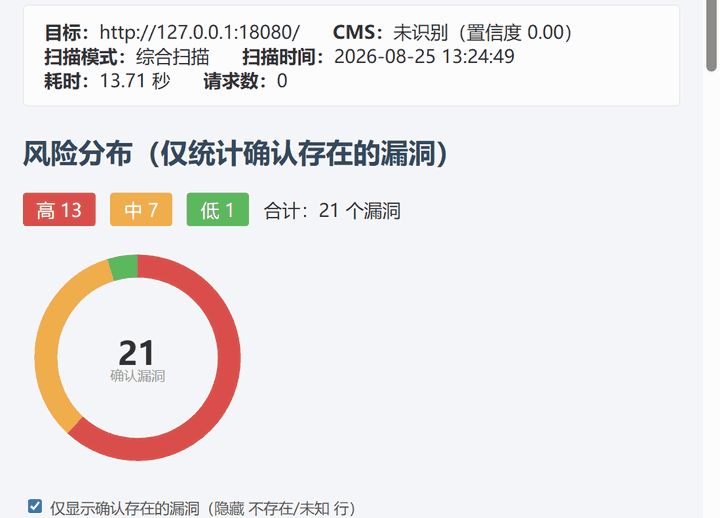

# Ruoyi-Scan — 若依专项漏洞扫描工具

[](https://github.com/xiabai2008/Ruoyi-Scan/actions/workflows/ci.yml)
[](https://pypi.org/project/ruoyi-scan/)
[](https://pypi.org/project/ruoyi-scan/)
[](https://www.python.org/downloads/)
[](docs/SECURITY.md)
[](https://codecov.io/gh/xiabai2008/Ruoyi-Scan)
[](https://securityscorecards.dev/viewer/?uri=github.com/xiabai2008/ruoyi-scan)

> 一款合法授权的 **若依（RuoYi）专项漏洞扫描器**。插件化架构，三态判定
> （**CONFIRMED / SAFE / UNKNOWN**），51 个 POC，支持批量扫描、WAF 绕过、
> 漏洞利用链、Web API 等企业级特性。
>
> 🛠️ **在二次开发？** — 请先看 [二次开发指南](docs/SECONDARY_DEV.md)，
> 了解项目架构、开发环境搭建、常见扩展场景和提交规范。

```bash
pip install ruoyi-scan
```

> 不想碰命令行？直接下载 [桌面端单文件版](https://github.com/xiabai2008/ruoyi-scan/releases)，双击运行（约 46 MB，免安装，引擎与 51 个 POC 全部内嵌）。

---

## 演示

<p align="center">
  
</p>

---

## 为什么不直接用通用扫描器

Ruoyi-Scan **不与 nuclei / xray 竞争，而是互补** —— 它们负责广度，我们负责
若依生态的深度与判定纪律。

| 维度 | nuclei | xray | **Ruoyi-Scan** |
|------|--------|------|----------------|
| 定位 | 通用 POC 引擎 | 通用 Web 扫描器 | **若依 / 国产 Java 框架专项** |
| 若依变体识别 | — | — | **5 变体**（Vue3 / App / Plus / Cloud / Cloud-Plus） |
| 版本感知 POC 过滤 | — | — | **4.2 / 4.7 / v5 / 3.9.x 版本矩阵** |
| 三态判定 | 无此概念 | 无此概念 | **CONFIRMED / SAFE / UNKNOWN** |
| 网络异常情形 | 报错或跳过 | — | **强制 UNKNOWN，绝不冒充 SAFE** |
| 合规映射 | — | — | 等保 2.0 / OWASP **报告级章节** |
| 安服交付物 | — | 部分 | 7 种格式 + **docx 模板引擎 + 整改复测** |
| nuclei 模板 | 原生 | 不支持 | **兼容执行**（http 协议子集 + 安全白名单） |

**一句话**：通用扫描器告诉你「这里可能有东西」；Ruoyi-Scan 告诉你「这个漏洞确实存在 / 确实不存在 / 无法判定」，并直接产出可交付的报告。

若依是国内应用最广的开源 Java 后台框架之一，二次开发项目在政企与外包中大量存在。通用工具在它面前的问题是**不知道对面是什么** —— 指纹粗糙、变体不辨、版本无感，于是误报与漏报同时发生。我们把「扫得准」做在前面。

---

## 快速开始

### 方式一：pip 安装（推荐）

```bash
pip install ruoyi-scan

# 可选依赖（按需安装）
pip install pyyaml          # YAML 配置文件
pip install redis           # Redis 分布式扫描
pip install aiohttp         # 异步 HTTP 客户端

# 快速漏洞扫描
ruoyi-scan -p http://target:8080/

# 综合扫描（目录 + 漏洞 + 爆破）
ruoyi-scan -u http://target:8080/

# 批量扫描
ruoyi-scan -f targets.txt -p --report ./reports
```

### 方式二：桌面端（双击即用）

前往 [Releases 页面](https://github.com/xiabai2008/ruoyi-scan/releases) 下载 `ruoyi-scan-desktop.exe`，约 46 MB，无需安装无需 Python 环境。

### 方式三：源码开发

```bash
git clone https://github.com/xiabai2008/Ruoyi-Scan.git
cd Ruoyi-Scan
pip install -r requirements.txt

python main.py -p http://target:8080/
```

### Docker 部署

```bash
docker compose up -d                        # 一键启动（扫描器 + API + 2 个靶场）
docker compose run --rm scanner -p http://lab-ruoyi:8080/   # 扫描内置靶场
```

---

## 扫描模式

核心命令只有两个：`-p`（单目标漏洞扫描）和 `-u`（综合扫描）。

| 对比项 | `-p` 单目标漏洞扫描 | `-u` 综合扫描 |
|--------|----------------------|----------------|
| 执行内容 | 仅执行 `vuln` 类插件 | 全流程：recon（目录扫描）→ vuln（漏洞检测）→ brute（弱口令爆破） |
| 特点 | 速度快、请求量小 | 完整风险评估，耗时较长 |
| 适合场景 | 已知目标，快速确认漏洞 | 需要对目标做全面评估 |

---

## 文档中心

> 全部文档已编组上线（mkdocs-material + GitHub Pages），推荐从
> **[在线文档站](https://xiabai2008.github.io/ruoyi-scan/)** 开始阅读。

### 📖 用户文档

| 文档 | 说明 |
|------|------|
| [快速上手](docs/quickstart.md) | 5 分钟从安装到出第一份报告 |
| [用户指南](docs/usage.md) | 安装配置、扫描模式、详细参数说明 |
| [CLI 参考](docs/cli-reference.md) | 全部 CLI 参数按功能分组速查（**原 README 中 CLI 参数表已迁移至此**） |
| [核心能力总览](docs/features.md) | 27 个功能模块系统性梳理（**原 README 核心能力大表已迁移至此**） |
| [插件开发教程](docs/plugin_dev.md) | PluginBase、三态判定、entry_points 注册 |
| [插件模板仓库](docs/template_repo.md) | 社区模板分发 + Ed25519 验签 |
| [API 文档](docs/api.md) | REST 端点、WebSocket 事件、OpenAPI 规范 |
| [DevSecOps 集成](docs/devsecops.md) | CI/CD 流水线模板、SARIF、DefectDojo |
| [版本矩阵](docs/version-matrix.md) | 若依各版本漏洞检出矩阵 |
| [检出能力矩阵](docs/verification-matrix.md) | 51 个 POC 的验证级别与证据等级 |
| [桌面端](docs/desktop.md) | 单 exe 架构、进程回收、卸载清理等实现细节 |

### 🛠️ 开发者文档（**二次开发必读**）

| 文档 | 说明 |
|------|------|
| **[二次开发指南](docs/SECONDARY_DEV.md)** | 🆕 面向二次开发者：架构总览、开发环境、插件扩展点、常见场景、打包分发 |
| [贡献指南](docs/CONTRIBUTING.md) | 开发流程、代码规范、PR 约定、测试规范 |
| [社区总览](docs/community.md) | Issue / PR / 社区治理 |
| [发布流程](docs/release.md) | Release 产物构建与发布流程 |
| [安全报告说明](docs/security_report.md) | 安全评估报告的解读 |
| [发展路线图](docs/ROADMAP.md) | G1-G5 阶段规划 + 度量仪表盘 |

### 🔧 工程文档（原根目录 md 已迁移至 docs/）

| 文档 | 说明 |
|------|------|
| [变更日志](docs/CHANGELOG.md) | 版本历史与变更记录（Keep a Changelog 格式） |
| [安全策略](docs/SECURITY.md) | 漏洞报告流程 + 合法使用声明 |

---

## 项目定位

| 项目 | 值 |
|------|-----|
| 作者 | XIABAI |
| 版本 | 1.4.3 |
| 仓库 | https://github.com/xiabai2008/Ruoyi-Scan |
| PyPI | https://pypi.org/project/ruoyi-scan/ |
| 技术栈 | Python 3.8+ / requests / FastAPI / Docker |
| 许可 | [MIT License](docs/SECURITY.md) |

---

## 项目结构

```
Ruoyi-Scan/
├── main.py              # CLI 入口（~440 行）
├── core/                # 核心引擎层（runner/engine/models/fingerprint/chain/report...）
├── plugins/             # 插件系统（ruoyi 18 / spring 14 / common 11 / jeecgboot 8）
├── lib/                 # 工具库（33 个模块）
├── api/                 # FastAPI Web API + WebSocket
├── cli/                 # CLI 子命令分发
├── chains/              # 漏洞利用链（DAG 编排）
├── config/              # 全局配置 + 指纹库 + 模板
├── data/                # 字典文件 + CVE 离线库
├── common/              # 通用工具
├── lab/                 # 签名靶场（Flask）
├── tests/               # 51 个测试文件 / 1000+ 条用例
├── docs/                # 📁 **统一文档管理（原根目录 md 已全部迁入）**
├── web/                 # Web 控制台前端
├── monitoring/          # Prometheus + Grafana
├── desktop/             # 桌面端 exe 打包（PyInstaller + Tauri）
├── examples/            # 示例配置与 nuclei 模板
├── scripts/             # 辅助脚本
├── Dockerfile           # Docker 镜像
└── docker-compose.yml   # Docker 编排（扫描器 + API + 2 靶场 + 监控栈）
```

---

## 测试

```bash
# 全量测试
python -m pytest tests/ -q

# 若依 / Spring 插件回归
python tests/regression_ruoyi.py
python tests/regression_spring.py

# 误报基线门禁
python -m pytest tests/test_fp_baseline.py -q
```

---

## 贡献

欢迎贡献 POC 与改进：

- **提交 POC**：`python main.py --plugin-init <name>` 生成骨架 → 实现 `verify()`（三态判定）→ `--plugin-check` 验证 → PR
- **模板分发**：合入后自动进入 [ruoyi-scan-templates](https://github.com/xiabai2008/ruoyi-scan-templates) 官方仓库（Ed25519 签名）
- **完整指南**：详见 [贡献指南](docs/CONTRIBUTING.md)（开发流程、代码规范、测试规范、约定式提交）
- **安全报告**：请勿通过 GitHub Issue 公开报告安全漏洞，请遵循 [安全策略](docs/SECURITY.md) 中的私下报告流程

---

## 安全与合规

本工具仅用于**授权范围内**的安全测试与学习研究。不得用于未授权目标。
涉及利用的插件默认仅做存在性验证，不做实际破坏。

**供应链验证**：Release 产物附带 SHA256 校验和，可独立验证；v1.4.3 起同时提供
SLSA 构建来源证明。详见 [安全策略](docs/SECURITY.md)。

---

## License

MIT License © 2026 XIABAI